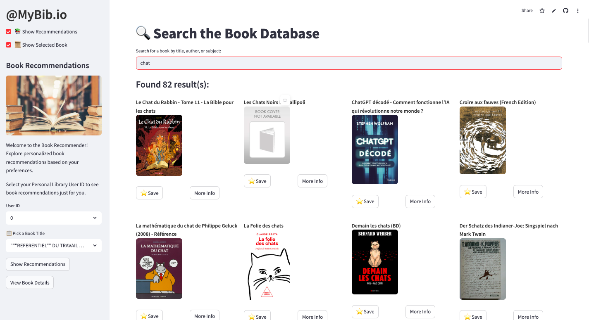

# Book Recommender System using Machine Learning

Rank on Kaggle competition: #7 (0.1578) on 21.05

This project aims to develop a personalized book recommender system. Using five different recommender models, the system analyzes implicit user interactions and book metadata to generate accurate and tailored suggestions.

## Project Workflow:

**Data Exploration** 

The project begins with loading the user-book interactions dataset and the book metadata. Various attributes such as book title, authors, subject, and publisher are examined to gain insights into the data structure and distribution.

**Data Cleaning** 

This stage mainly involves handling duplicate entries, and ensuring consistency in column names and data types, and getting rid of the NA rows.

**Exploratory Data Analysis (EDA)**

EDA techniques such as visualization and aggregation are employed to understand the distribution and relationships within the dataset. 
In the" interactions " dataset, there is a diverse set of users, with the number of interactions per user following a long-tail distribution: most users interact with only a few items, while a few are highly active. Similarly, a small number of books receive a large number of interactions, while most receive few. The most active users (User ID) and most popular books are visualized, highlighting the top 10 in each category. 
The analysis with respect to the metadata includes exploring the distribution of the top 15 subjects ,top publishers, and authors based on various metrics.

**Recommender Models**

5 different recommender models are implemented in total. As a baseline, both user-based and item-based collaborative filtering approaches were implemented. Next, a model incorporating embeddings was introduced, followed by a hybrid model that combines predictions from collaborative filtering and embeddings. Finally, a content-based approach using TF-IDF was developed. The model with the highest MAP@10 score was finally selected for the submission. To enhance the metadata, two different APIs were used.

## Description of Recommender Models:

**Versions 1 & 2: Collaborative Filtering**

The baseline version of our recommender uses user-based and item-based collaborative filtering.

**Version 3: Metadata Enhancement and Embeddings**

To improve the recommender, data augmentation was done on the books' metadata, using 2 APIs: Google Books and Open Library. This allowed to retrieve missing metadata, such as author names, publishers, etc. Then, to represent this metadata, text embeddings were used. We opted for the HuggingFace all-MiniLM-L6-v2 Sentence Transformer model. This model maps sentences & paragraphs to a 384 dimensional dense vector space. This model actually gave us worse scores than the baseline, prompting us to look for other solutions.

**Version 4: Hybrid Model with CF and Embeddings**

Building on previously tried models, we computed a hybrid score combining the collaborative filtering and embeddings models. To compute the score, we normalized the CF and embeddings scores using the `MinMaxScaler`. The score was then calculated using the following formula: `hybrid_scores = alpha * normalized_cf + (1 - alpha) * normalized_cb`. We did some hyperparameter tuning of the alpha parameter, trying a range of values between 0 and 1 by .1 increments, and selected a value of 0.7, which gave us the highest MAP@10 of 0.1910.

**Version 5: TF-IDF**

Our last model involves using TF-IDF on the items with enhanced metadata. We did some minimal preprocessing of the text (more involved preprocessing resulted in lower scores) and added a popularity boost, weighing the items by their number of interactions. We also tuned the TF-IDF vectorizer in an iterative, trial-and-error process. The final specification uses French stopwords and a max number of features of 1000000. This parameter controls how many features at max the vectorizer keeps when converting text into a TF-IDF matrix. We also applied sublinear term frequency scaling; this applies a logarithmic transformation to dampen the effect of very frequent terms. We also included the argument `ngram_range=(1,3)`, to extract unigrams, bigrams and trigrams (respectively 1-, 2- and 3-word sequences), allowing us to better capture context and word order. This model resulted in the highest MAP@10 value across all models, reaching 0.8092. We thus used this model for our final submission.

The final performance metrics are reported in the table below.

| Metric        | User-User CF | Item-Item CF | Embeddings | Hybrid Model | TF-IDF  |
|---------------|--------------|--------------|------------|--------------|---------|
| Precision@10  | 0.0565       | 0.0557       | 0.0389     | 0.0608       | 0.1746  |
| Recall@10     | 0.2905       | 0.2640       | 0.2391     | 0.2980       | 0.8948  |
| MAP@10        | 0.1800       | 0.1632       | 0.1527     | 0.1912       | 0.8092  |

**Visual Assessment of TF-IFD Model**

Finally, to assess our recommender system in a more visual way, we display the recommendations for a random user. Here, with the random seed that we use for reproducibility, we see the recommendations for User 2882. It appears that this user’s recommendations have a theme of books focused on history and politics, such as a book on Ukraine’s history, Europe in 1945-1950, and a constitutional history of Switzerland. Let’s display now the user’s history of book interactions. We see that this user has interacted with a book on direct democracy and on antipopulism. It appears that for this user in particular, our recommendations seem quite aligned with their history, although there are a few outliers in the recommendations, such as a book on children’s education. 
For this reason, we see our analysis as successful (as it worked quite well for all the users) and we decide to move on with the last part of the project, which involved putting into practice our work.

## Interactive Recommendations on Streamlit APP

The project offers an interactive interface using Streamlit and ipywidgets, allowing users to explore specific books. The following is the link to access the app: https://machine-learning-project-book-recommender-v4jrgnjk2j4hnkhp42j6.streamlit.app/ . In addition to the previous API, we expanded the metadata with a stronger one, that included other variables. This is because we want the USER to have the best experience possible on our app. We therefore added many more details, such as the language, description of the book and, above all, the Book covers. 

By combining machine learning algorithms with interactive visualization, the Book Recommendation System provides a user-friendly platform for discovering new books tailored to individual preferences. Whether users are searching for popular titles from favorite publishers or exploring books by preferred authors, this system offers personalized recommendations to enhance their reading experience.

Now you can try our amazing app and enjoy reading your taylor-made recommended books while being impressed by the power of Machine Learning! 

Here is the example of looking for a specific word like : "chat" and the related items found. 

